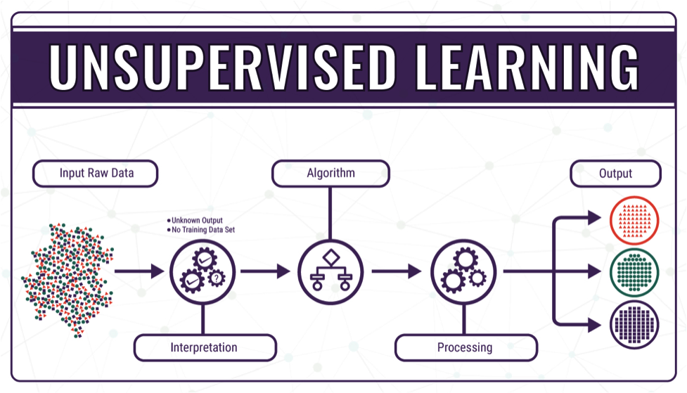

# Unsupervised Learning  A to Z with Python

## Unsupervised learning

Unsupervised learning is a simple learning model, but as the name suggests, it lacks a critic and has no way to measure its performance. The goal is to build a mapping function that categorizes the data into classes based on features hidden within the data.

## K-means clustering

k-means clustering is a simple and popular clustering algorithm that originated in signal processing. The goal of the algorithm is to partition examples from a data set into k clusters. Each example is a numerical vector that allows the distance between vectors to be calculated as a Euclidean distance.
